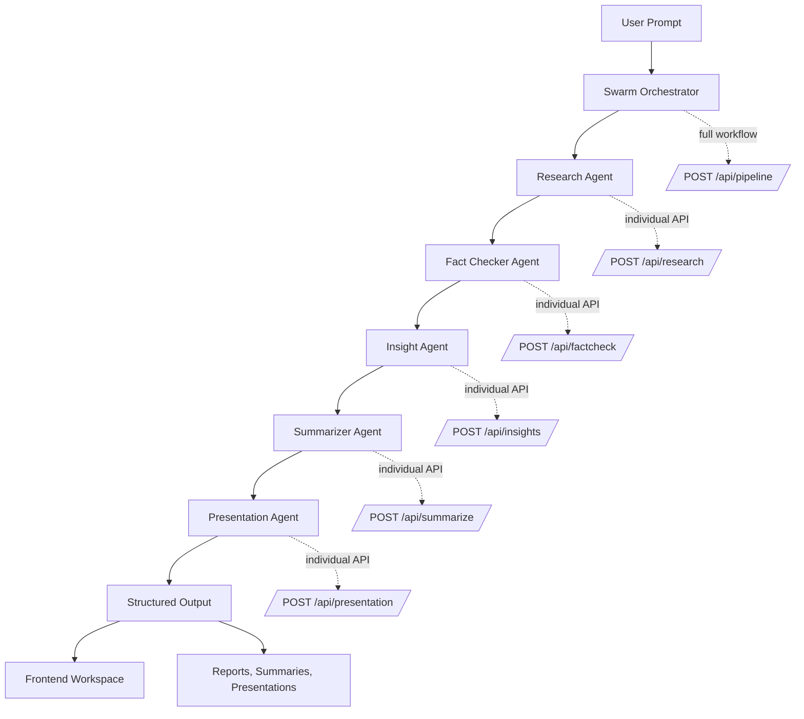
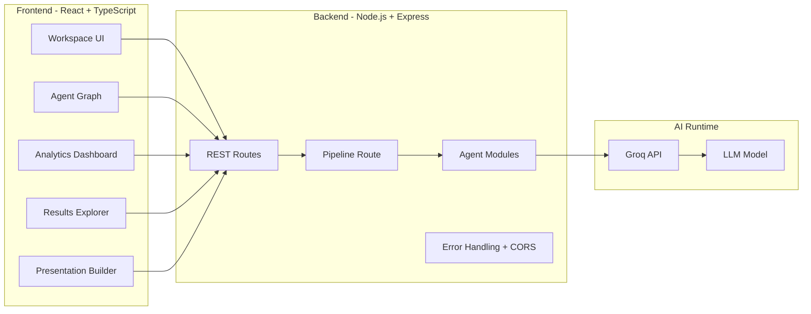

# SwarmX AI

<p align="center">
  
</p>

<p align="center">
  <a href="https://swarmx-ai-p2v4.onrender.com/"><strong>Live Demo</strong></a>
  ·
  <a href="#agent-swarm-architecture">Architecture</a>
  ·
  <a href="#api-overview">API</a>
  ·
  <a href="#local-development-setup">Local Setup</a>
  ·
  <a href="#swarmx-ai-team">Team</a>
</p>

<p align="center">
  
  
  
  
  
  
</p>

<p align="center">
  <strong>Built for the Microsoft Build AI Challenge - Agent Swarms</strong>
</p>

---

## Project Introduction

**SwarmX AI** is an autonomous multi-agent intelligence platform where specialized AI agents collaborate to perform deep research, verify information, generate insights, create structured summaries, and produce presentation-ready outputs through intelligent agent orchestration.

The project demonstrates **Agent Swarm Architecture**: instead of relying on one general-purpose assistant, SwarmX AI coordinates multiple focused agents that each contribute a distinct capability to a larger reasoning workflow. The result is a system designed for higher-quality research, stronger validation, cleaner synthesis, and outputs that are ready to share.

> Complex questions deserve more than one perspective. SwarmX AI turns research into a coordinated intelligence workflow.

---

## Live Demo

<p align="center">
  <a href="https://swarmx-ai-p2v4.onrender.com/">
    
  </a>
</p>

**Live Application:** [https://swarmx-ai-p2v4.onrender.com/](https://swarmx-ai-p2v4.onrender.com/)

Use the live deployment to explore the agent workspace, trigger AI workflows, inspect generated outputs, and experience the swarm orchestration model in action.

---

## Key Features

| Feature | Description |
| --- | --- |
| Autonomous Agent Swarm | Coordinates multiple specialized AI agents across a unified workflow. |
| Deep Research Engine | Collects, expands, and analyzes information for complex user prompts. |
| Fact Verification | Reviews claims, validates information, and returns confidence-oriented checks. |
| Insight Generation | Detects trends, extracts implications, and produces strategic recommendations. |
| Smart Summarization | Converts long-form agent output into concise, structured summaries. |
| Presentation Builder | Transforms research intelligence into presentation-ready content. |
| Interactive Agent UI | Visualizes agents, workflow states, results, and analytics through a modern frontend. |
| REST API Backend | Provides clear endpoints for individual agents and complete pipeline execution. |
| Export-Oriented UX | Designed around outputs that can be used in reports, pitches, and presentations. |

### Feature Cards

| Research | Verification | Insights | Summary | Presentation |
| --- | --- | --- | --- | --- |
| Deep topic exploration | Claim validation | Trend discovery | Key finding extraction | Slide-ready structure |
| Context gathering | Confidence scoring | Recommendations | Concise synthesis | Executive communication |
| Knowledge expansion | Reliability checks | Predictive signals | Readable outputs | Hackathon-ready demos |

---

## Agent Swarm Architecture

SwarmX AI uses a modular swarm model where each agent owns a specific reasoning responsibility. This separation improves clarity, makes orchestration easier to extend, and mirrors how high-performing teams solve complex knowledge work.

| Agent | Role | Output |
| --- | --- | --- |
| **Research Agent** | Performs deep research and information gathering. | Expanded topic analysis, context, and source-oriented findings. |
| **Fact Checker Agent** | Verifies claims and validates generated information. | Fact checks, confidence scores, and reliability signals. |
| **Insight Agent** | Identifies trends, recommendations, and predictive signals. | Strategic insights and decision-support observations. |
| **Summarizer Agent** | Creates concise summaries and extracts key findings. | Executive summaries and compressed knowledge artifacts. |
| **Presentation Agent** | Converts intelligence into presentation-ready content. | Structured slides, talking points, and polished narrative flow. |

---

## System Workflow Diagram



### High-Level Architecture



---

## Technology Stack

### Frontend

| Category | Technology |
| --- | --- |
| Framework | React |
| Language | TypeScript |
| Build Tool | Vite |
| Styling | Tailwind CSS |
| UI System | Shadcn UI-style components |
| Animation | Framer Motion |
| Agent Visualization | React Flow |
| State Management | Zustand |
| HTTP Client | Axios |
| Charts | Recharts |

### Backend

| Category | Technology |
| --- | --- |
| Runtime | Node.js |
| Server | Express.js |
| AI Provider | Groq API |
| Interface | REST APIs |
| Configuration | dotenv |
| Middleware | CORS, JSON parsing, centralized error handling |

### Deployment

| Layer | Platform |
| --- | --- |
| Application Hosting | Render |
| Live URL | [swarmx-ai-p2v4.onrender.com](https://swarmx-ai-p2v4.onrender.com/) |

---

## Frontend Architecture

The frontend is designed as a modern AI workspace that makes agent collaboration visible and usable.

```text
Frontend/
  src/
    components/        Reusable UI, system status, results, and swarm components
    config/            Runtime environment configuration
    hooks/             API mutation and backend health hooks
    layouts/           Application shell and navigation structure
    pages/             Workspace, dashboards, landing, results, presentation builder
    services/          Axios API clients and swarm API functions
    store/             Zustand state management
    styles/            Global styling
    types/             Shared TypeScript API and swarm types
    utils/             Agent metadata, exporters, formatting, storage helpers
```

### Frontend Highlights

| Area | Purpose |
| --- | --- |
| Agent Workspace | Main interaction surface for running AI swarm tasks. |
| Swarm Graph | Visual representation of agent collaboration and execution flow. |
| Results Explorer | Organized view for generated research, summaries, insights, and checks. |
| Analytics Dashboard | UI layer for telemetry-style metrics and workflow visibility. |
| Presentation Builder | Converts generated intelligence into structured presentation content. |
| Backend Status | Health-aware UI feedback for API availability. |

---

## Backend Architecture

The backend exposes a clean Express API with independent agent routes and a combined pipeline route for full swarm orchestration.

```text
backend/
  agents/              Research, summary, insight, fact-check, and presentation agents
  config/              Groq client configuration
  middleware/          Error and not-found handlers
  routes/              REST endpoints for each agent and the full pipeline
  services/            Shared research service logic
  utils/               Logger utilities
  app.js               Express app configuration
  server.js            Server startup and graceful shutdown
```

### Backend Highlights

| Layer | Responsibility |
| --- | --- |
| Express App | Configures CORS, JSON parsing, health checks, routes, and middleware. |
| Agent Modules | Encapsulate the prompt and execution logic for each AI role. |
| Pipeline Route | Runs multi-agent orchestration through a unified endpoint. |
| Groq Config | Centralizes model provider configuration and credentials. |
| Error Middleware | Provides consistent API error handling. |
| Graceful Shutdown | Handles termination signals cleanly in production. |

---

## API Overview

Base URL for local development:

```text
http://localhost:5000
```

| Method | Endpoint | Purpose |
| --- | --- | --- |
| `GET` | `/health` | Check backend status and runtime health. |
| `POST` | `/api/research` | Run the Research Agent. |
| `POST` | `/api/summarize` | Run the Summarizer Agent. |
| `POST` | `/api/factcheck` | Run the Fact Checker Agent. |
| `POST` | `/api/insights` | Run the Insight Agent. |
| `POST` | `/api/presentation` | Run the Presentation Agent. |
| `POST` | `/api/pipeline` | Run the full multi-agent workflow. |

### Example Request

```bash
curl -X POST http://localhost:5000/api/pipeline \
  -H "Content-Type: application/json" \
  -d '{
    "topic": "How can agent swarms improve enterprise research workflows?"
  }'
```

### Typical Response Shape

```json
{
  "success": true,
  "data": {
    "research": "...",
    "factCheck": "...",
    "insights": "...",
    "summary": "...",
    "presentation": "..."
  }
}
```

---

## Project Folder Structure

```text
SwarmX-AI/
  README.md
  .gitignore
  backend/
    agents/
      factCheckAgent.js
      insightAgent.js
      presentationAgent.js
      researchAgent.js
      summaryAgent.js
    config/
      groq.js
    middleware/
      errorMiddleware.js
    routes/
      factcheck.js
      insight.js
      pipeline.js
      presentation.js
      research.js
      summarize.js
    services/
      researchService.js
    utils/
      logger.js
    app.js
    server.js
    package.json
    .env.example
  Frontend/
    src/
      components/
      config/
      hooks/
      layouts/
      pages/
      services/
      store/
      styles/
      types/
      utils/
    package.json
    .env.example
```

---

## Installation Guide

### Prerequisites

| Requirement | Version |
| --- | --- |
| Node.js | 18 or higher |
| npm | 9 or higher recommended |
| Groq API Key | Required for AI agent execution |

### 1. Clone the Repository

```bash
git clone https://github.com/your-username/SwarmX-AI.git
cd SwarmX-AI
```

### 2. Install Backend Dependencies

```bash
cd backend
npm install
```

### 3. Install Frontend Dependencies

```bash
cd ../Frontend
npm install
```

---

## Local Development Setup

### Start the Backend

```bash
cd backend
npm run dev
```

Backend runs on:

```text
http://localhost:5000
```

### Start the Frontend

```bash
cd Frontend
npm run dev
```

Vite will start the frontend development server and print the local URL in your terminal.

### Build the Frontend

```bash
cd Frontend
npm run build
```

### Run Backend Tests

```bash
cd backend
npm test
```

---

## Environment Variables

### Backend Environment

Create `backend/.env` from `backend/.env.example`.

| Variable | Required | Description |
| --- | --- | --- |
| `PORT` | No | Backend port. Defaults to `5000`. |
| `NODE_ENV` | No | Runtime environment such as `development` or `production`. |
| `GROQ_API_KEY` | Yes | Groq API key used by all AI agents. |
| `AI_MODEL` | No | Model name. Example: `llama-3.3-70b-versatile`. |
| `AI_TEMPERATURE` | No | Controls generation creativity. |
| `AI_MAX_TOKENS` | No | Maximum response token budget for agent outputs. |
| `LOG_LEVEL` | No | Logging level. |
| `DEBUG` | No | Debug mode toggle. |

Example:

```env
PORT=5000
NODE_ENV=development
GROQ_API_KEY=your_groq_api_key_here
AI_MODEL=llama-3.3-70b-versatile
AI_TEMPERATURE=0.2
AI_MAX_TOKENS=1200
LOG_LEVEL=info
DEBUG=false
```

### Frontend Environment

Create `Frontend/.env` from `Frontend/.env.example`.

| Variable | Required | Description |
| --- | --- | --- |
| `VITE_APP_NAME` | No | Public app name displayed in the UI. |
| `VITE_APP_ENV` | No | Frontend runtime environment. |
| `VITE_API_BASE_URL` | Yes | Backend API base URL used by Axios. |
| `VITE_ENABLE_ANALYTICS` | No | Enables analytics dashboard features. |
| `VITE_ENABLE_VOICE_INPUT` | No | Feature flag for voice input controls. |
| `VITE_ENABLE_EXPORTS` | No | Enables PDF/PPT export actions. |
| `VITE_ENABLE_SWARM_ANIMATION` | No | Enables visible swarm animation sequences. |
| `VITE_DEFAULT_THEME` | No | Default UI theme. |

Example:

```env
VITE_APP_NAME=SwarmX AI
VITE_APP_ENV=development
VITE_API_BASE_URL=http://localhost:5000
VITE_ENABLE_ANALYTICS=true
VITE_ENABLE_VOICE_INPUT=true
VITE_ENABLE_EXPORTS=true
VITE_ENABLE_SWARM_ANIMATION=true
VITE_DEFAULT_THEME=dark
```

---

## Deployment Information

SwarmX AI is deployed on **Render**.

| Item | Value |
| --- | --- |
| Platform | Render |
| Live Application | [https://swarmx-ai-p2v4.onrender.com/](https://swarmx-ai-p2v4.onrender.com/) |
| Backend Runtime | Node.js |
| Frontend Build | Vite production build |
| API Style | REST |

### Production Checklist

- Set `GROQ_API_KEY` in the Render environment configuration.
- Configure the backend service with Node.js 18 or higher.
- Point `VITE_API_BASE_URL` to the production backend URL.
- Run `npm run build` for the frontend before deployment.
- Confirm `/health` returns a healthy response after deployment.

---

## Screenshots

Add screenshots to a `docs/screenshots/` directory and update the image paths below.

| View | Preview |
| --- | --- |
| Landing Experience | `docs/screenshots/landing.png` |
| Agent Workspace | `docs/screenshots/workspace.png` |
| Swarm Graph | `docs/screenshots/swarm-graph.png` |
| Results Explorer | `docs/screenshots/results.png` |
| Analytics Dashboard | `docs/screenshots/analytics.png` |
| Presentation Builder | `docs/screenshots/presentation-builder.png` |

```md


```

---

## Future Roadmap

| Status | Roadmap Item |
| --- | --- |
| Planned | Source citation and retrieval-augmented research workflows. |
| Planned | Agent memory for multi-session intelligence continuity. |
| Planned | Human-in-the-loop review controls for fact-check approval. |
| Planned | Exportable PDF and PPT templates for business-ready reports. |
| Planned | Team workspaces and collaborative research sessions. |
| Planned | Streaming agent execution updates over WebSockets or Server-Sent Events. |
| Planned | Custom agent creation and workflow builder. |
| Planned | Evaluation dashboard for agent accuracy, latency, and output quality. |

---

## Performance Highlights

| Highlight | Impact |
| --- | --- |
| Specialized Agent Roles | Reduces prompt complexity by assigning focused tasks to each agent. |
| Modular REST Endpoints | Enables individual testing, debugging, and agent reuse. |
| Pipeline Execution | Supports end-to-end orchestration from one API call. |
| Lightweight Backend | Express-based architecture keeps the API simple and deployable. |
| Vite Frontend | Fast local development and optimized production builds. |
| Feature Flags | Environment-driven controls for analytics, exports, animation, and future features. |

---

## Why SwarmX AI is Different

Most AI tools present a single conversational interface. SwarmX AI is built around a stronger idea: **intelligence should be orchestrated**.

| Traditional AI Assistant | SwarmX AI |
| --- | --- |
| One model handles every task. | Multiple specialized agents collaborate. |
| Output quality depends on one prompt. | Workflow quality improves through staged reasoning. |
| Research, verification, and summarization are blended together. | Each step has a clear agent owner. |
| Hard to inspect the process. | Agent workflow is visible through the UI and API. |
| Often stops at text generation. | Produces structured, presentation-ready outputs. |

SwarmX AI is designed for people who need answers they can actually use: founders, analysts, students, researchers, product teams, consultants, and hackathon judges evaluating practical AI systems.

---

## Microsoft Build AI Challenge Alignment

SwarmX AI directly aligns with the **Microsoft Build AI Challenge - Agent Swarms** theme by demonstrating how multiple agents can coordinate to solve complex tasks.

| Challenge Principle | SwarmX AI Implementation |
| --- | --- |
| Multi-agent collaboration | Research, fact-checking, insight, summary, and presentation agents work together. |
| Specialized reasoning | Each agent owns a focused intelligence function. |
| Orchestrated workflows | The `/api/pipeline` endpoint coordinates the complete swarm process. |
| Practical AI utility | Outputs are designed for real-world research and presentation use cases. |
| Extensible architecture | New agents can be added through modular backend routes and frontend UI patterns. |

---

## Contributing Guidelines

Contributions are welcome. SwarmX AI is structured so developers can improve agents, UI workflows, API behavior, and deployment reliability without needing to rewrite the whole system.

### How to Contribute

1. Fork the repository.
2. Create a feature branch.
3. Make a focused change.
4. Test the backend and frontend locally.
5. Open a pull request with a clear description.

### Contribution Areas

| Area | Examples |
| --- | --- |
| Agents | New agent roles, better prompts, stronger validation, improved orchestration. |
| Frontend | Workflow UX, visual polish, accessibility, dashboards, export flows. |
| Backend | API reliability, validation, logging, tests, streaming responses. |
| Documentation | Setup guides, screenshots, architecture notes, demo walkthroughs. |

### Development Standards

- Keep changes focused and easy to review.
- Avoid committing secrets or local `.env` files.
- Use environment variables for runtime configuration.
- Prefer readable, maintainable code over clever shortcuts.
- Include testing notes in pull requests.

---

## License

This project is licensed under the **MIT License**.

You are free to use, modify, and distribute this project in accordance with the terms of the MIT License.

---

## 👥 SwarmX AI Team

SwarmX AI is the result of a collaborative effort by a passionate team of AI developers and innovators:

| Team Members |
|-------------|
| Het Patel |
| Naitik Vadher |
| Vansh Pathak |

Together, the team created a multi-agent AI ecosystem where specialized agents collaborate to perform deep research, verify information, generate insights, produce summaries, and create presentation-ready outputs. Built for the Microsoft Build AI Agent Swarms Challenge, SwarmX AI demonstrates the power of autonomous agent orchestration and next-generation AI systems.
---

## Acknowledgements

SwarmX AI was created for the **Microsoft Build AI Challenge - Agent Swarms**.

Special thanks to:

- Microsoft Build for inspiring builders to explore the next generation of agentic AI systems.
- Groq for high-performance AI inference capabilities.
- Render for simple cloud deployment.
- The open-source ecosystem behind React, TypeScript, Vite, Tailwind CSS, Express, Zustand, Framer Motion, React Flow, Axios, and Recharts.

---

<p align="center">
  <strong>SwarmX AI</strong>
  <br />
  Autonomous multi-agent intelligence for research, verification, insights, summaries, and presentation-ready outputs.
  <br />
  <br />
  <a href="https://swarmx-ai-p2v4.onrender.com/">Open Live Demo</a>
</p>
