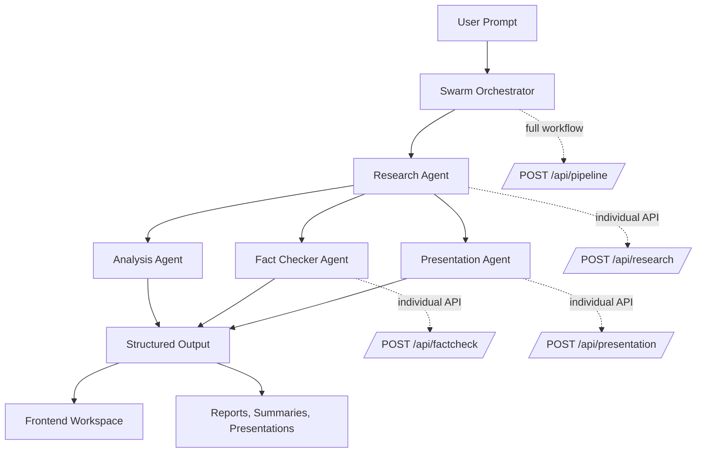
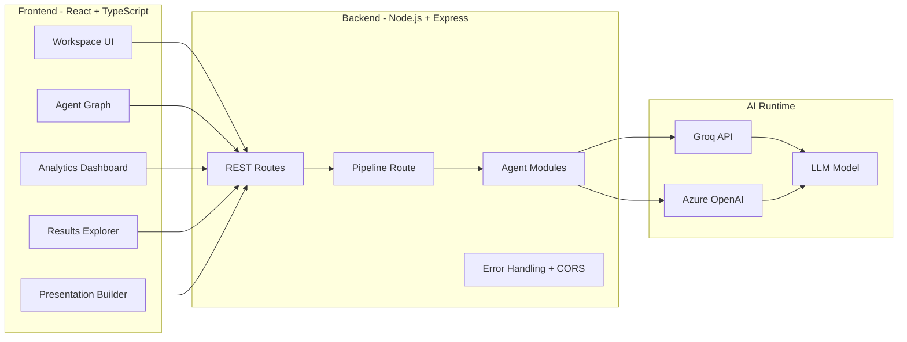

# SwarmX AI

<p align="center">
  
</p>

<p align="center">
  <a href="https://swarmx-ai-p2v4.onrender.com/"><strong>Live Demo</strong></a>
  ·
  <a href="#agent-swarm-architecture">Architecture</a>
  ·
  <a href="#api-overview">API</a>
  ·
  <a href="#local-development-setup">Local Setup</a>
  ·
  <a href="#swarmx-ai-team">Team</a>
</p>

<p align="center">
  
  
  
  
  
  
</p>

<p align="center">
  <strong>Built for the Microsoft Build AI Challenge - Agent Swarms</strong>
</p>

---

## Project Overview

**SwarmX AI** is an autonomous multi-agent intelligence platform where specialized AI agents collaborate to perform deep research, verify information, analyze contexts, and produce presentation-ready outputs through intelligent agent orchestration.

The project demonstrates **Agent Swarm Architecture**: instead of relying on one general-purpose assistant, SwarmX AI coordinates multiple focused agents that each contribute a distinct capability to a larger reasoning workflow. The result is a system designed for higher-quality research, stronger validation, robust analysis, and outputs that are ready to share.

> Complex questions deserve more than one perspective. SwarmX AI turns research into a coordinated intelligence workflow.

---

## Live Demo

<p align="center">
  <a href="https://swarmx-ai-p2v4.onrender.com/">
    
  </a>
</p>

**Live Application:** [https://swarmx-ai-p2v4.onrender.com/](https://swarmx-ai-p2v4.onrender.com/)

Use the live deployment to explore the agent workspace, trigger AI workflows, inspect generated outputs, and experience the swarm orchestration model in action.

---

## Key Features

| Feature | Description |
| --- | --- |
| Autonomous Agent Swarm | Coordinates multiple specialized AI agents across a unified workflow. |
| Deep Research Engine | Collects, expands, and analyzes information for complex user prompts. |
| Fact Verification | Reviews claims, validates information, and returns confidence-oriented checks. |
| Comprehensive Analysis | Consolidates summaries, trend discovery, and key insight extraction into a single robust process. |
| Presentation Builder | Transforms research intelligence into presentation-ready content. |
| Interactive Agent UI | Visualizes agents, workflow states, results, and analytics through a modern frontend. |
| REST API Backend | Provides clear endpoints for individual agents and complete pipeline execution. |
| Export-Oriented UX | Designed around outputs that can be used in reports, pitches, and presentations. |

### Feature Cards

| Research | Verification | Analysis | Presentation |
| --- | --- | --- | --- |
| Deep topic exploration | Claim validation | Key finding extraction | Slide-ready structure |
| Context gathering | Confidence scoring | Trend discovery | Executive communication |
| Knowledge expansion | Reliability checks | Concise synthesis | Hackathon-ready demos |

---

## Agent Swarm Architecture

SwarmX AI uses a modular swarm model where each agent owns a specific reasoning responsibility. This separation improves clarity, makes orchestration easier to extend, and mirrors how high-performing teams solve complex knowledge work.

| Agent | Role | Output |
| --- | --- | --- |
| **Research Agent** | Performs deep research and information gathering. | Expanded topic analysis, context, and source-oriented findings. |
| **Analysis Agent** | Analyzes research data to extract insights and construct summaries. | Executive summaries, strategic insights, predictive signals, and trends. |
| **Fact Checker Agent** | Verifies claims and validates generated information. | Fact checks, trust scores, and reliability signals. |
| **Presentation Agent** | Converts intelligence into presentation-ready content. | Structured slides, talking points, and polished narrative flow. |

---

## System Workflow Diagram



### High-Level Architecture



---

## Technology Stack

### Frontend

| Category | Technology |
| --- | --- |
| Framework | React (v18) |
| Language | TypeScript |
| Build Tool | Vite |
| Styling | Tailwind CSS |
| UI System | Class Variance Authority & Radix-like UI |
| Animation | Framer Motion |
| Agent Visualization | React Flow |
| State Management | Zustand |
| HTTP Client | Axios |
| Charts | Recharts |
| Document Export | jsPDF & PptxGenJS |

### Backend

| Category | Technology |
| --- | --- |
| Runtime | Node.js (v18+) |
| Server | Express.js |
| AI Providers | Groq API, Azure/GitHub Models |
| SDKs | groq-sdk, @google/generative-ai |
| Configuration | dotenv |
| Security | Helmet, CORS, Rate Limiting |

### Deployment

| Layer | Platform |
| --- | --- |
| Application Hosting | Render |
| Live URL | [swarmx-ai-p2v4.onrender.com](https://swarmx-ai-p2v4.onrender.com/) |

---

## Frontend Architecture

The frontend is designed as a modern AI workspace that makes agent collaboration visible and usable.

```text
Frontend/
  src/
    components/        UI elements, system status, results, and swarm components
    config/            Runtime environment validation (env.ts)
    hooks/             API hooks and custom React logic
    layouts/           Application shell and navigation structure
    lib/               Utility libraries and configurations
    pages/             AgentDashboardPage, WorkspacePage, AnalyticsDashboardPage...
    services/          Axios API clients and swarm API functions
    store/             Zustand state management
    styles/            Global styling
    types/             Shared TypeScript interfaces
    utils/             Formatting and storage helpers
```

### Frontend Highlights

| Area | Purpose |
| --- | --- |
| Agent Workspace | Main interaction surface for running AI swarm tasks. |
| Swarm Graph | Visual representation of agent collaboration and execution flow. |
| Results Explorer | Organized view for generated research, summaries, insights, and checks. |
| Analytics Dashboard | UI layer for telemetry-style metrics and workflow visibility. |
| Presentation Builder | Converts generated intelligence into structured presentation content. |
| Robust Validation | Strongly typed environment variables checking at runtime. |

---

## Backend Architecture

The backend exposes a clean Express API with independent agent routes and a combined pipeline route for full swarm orchestration.

```text
backend/
  agents/              analysisAgent.js, factCheckAgent.js, presentationAgent.js, researchAgent.js
  config/              Groq and environment configuration
  middleware/          Auth, Error, and Not-Found handlers
  routes/              REST endpoints: factcheck.js, pipeline.js, presentation.js, research.js
  services/            Shared logic and helper functions
  utils/               Logger and caching utilities
  app.js               Express app configuration with rate limiting and security headers
  server.js            Server startup and graceful shutdown
```

### Backend Highlights

| Layer | Responsibility |
| --- | --- |
| Express App | Configures Helmet, CORS, Rate Limiting, JSON parsing, routes, and middleware. |
| Agent Modules | Encapsulate prompts, error handling, retries, and execution logic. |
| Pipeline Route | Runs multi-agent orchestration efficiently through parallel execution in a unified endpoint. |
| Robust Execution | Wraps AI calls with caching, timeouts, semantic validation, and automatic retries. |
| Security Middleware| Provides rate limiting and API key authentication for secure API consumption. |

---

## API Documentation

Base URL for local development:

```text
http://localhost:5000
```

| Method | Endpoint | Purpose |
| --- | --- | --- |
| `GET` | `/` | Verify API status and uptime. |
| `GET` | `/health` | Check backend runtime health. |
| `POST` | `/api/research` | Run the Research Agent. |
| `POST` | `/api/factcheck` | Run the Fact Checker Agent. |
| `POST` | `/api/presentation` | Run the Presentation Agent. |
| `POST` | `/api/pipeline` | Run the full multi-agent orchestrator workflow. |

### Example Request

```bash
curl -X POST http://localhost:5000/api/pipeline \
  -H "Content-Type: application/json" \
  -H "X-API-Key: your_client_api_key_here" \
  -d '{
    "query": "How can agent swarms improve enterprise research workflows?"
  }'
```

---

## Environment Variables

### Backend Environment

Create `backend/.env` from `backend/.env.example`.

| Variable | Required | Description |
| --- | --- | --- |
| `PORT` | No | Backend port. Defaults to `5000`. |
| `NODE_ENV` | No | Runtime environment (`development` or `production`). |
| `GROQ_API_KEY` | Yes | Groq API key used by the Research and Presentation agents. |
| `AZURE_ENDPOINT` | Yes | Endpoint for models routed via Azure/GitHub models. |
| `GITHUB_TOKEN` | Yes | Auth token for Azure/GitHub models. |
| `PHI_MODEL` | No | Target model for fact-checking (default: `gpt-4o-mini`). |
| `AI_MODEL` | No | Standard model name used across agents. |
| `AI_TEMPERATURE` | No | Controls generation creativity (default: 0.2). |
| `AI_MAX_TOKENS` | No | Maximum response token budget for agent outputs. |
| `CLIENT_API_KEYS` | No | Comma-separated list of accepted API keys for frontend requests. |
| `FRONTEND_URL` | No | The exact URL of the frontend to configure CORS restrictions. |
| `TRUST_PROXY` | No | Set to `true` when deployed behind a reverse proxy (e.g., Render). |

### Frontend Environment

Create `Frontend/.env` from `Frontend/.env.example`.

| Variable | Required | Description |
| --- | --- | --- |
| `VITE_APP_NAME` | Yes | Public app name displayed in the UI. |
| `VITE_APP_ENV` | Yes | Runtime environment (development, production, test). |
| `VITE_API_BASE_URL` | Yes | Backend API base URL. |
| `VITE_ENABLE_ANALYTICS` | Yes | Enables analytics dashboard features (`true`/`false`). |
| `VITE_ENABLE_VOICE_INPUT` | Yes | Feature flag for voice input controls. |
| `VITE_ENABLE_EXPORTS` | Yes | Enables PDF/PPT export actions. |
| `VITE_ENABLE_SWARM_ANIMATION` | Yes | Enables visible swarm animation sequences. |
| `VITE_DEFAULT_THEME` | Yes | Default UI theme (`dark`, `light`, or `system`). |

---

## Project Folder Structure

```text
SwarmX-AI/
  README.md
  .gitignore
  docker-compose.yml
  package.json
  backend/
    agents/
    config/
    middleware/
    routes/
    services/
    utils/
    app.js
    server.js
    package.json
    .env
  Frontend/
    src/
      components/
      config/
      hooks/
      layouts/
      lib/
      pages/
      services/
      store/
      styles/
      types/
      utils/
    package.json
    .env
```

---

## Installation Guide

### Prerequisites

| Requirement | Version |
| --- | --- |
| Node.js | 18 or higher |
| npm | 9 or higher recommended |
| API Keys | Groq & GitHub/Azure required for AI execution |

### 1. Clone the Repository

```bash
git clone https://github.com/your-username/SwarmX-AI.git
cd SwarmX-AI
```

### 2. Install Dependencies Rapidly

From the root directory, run:

```bash
npm run install:all
```

---

## Local Development Setup

You can start both the frontend and backend concurrently from the root directory:

```bash
npm run start:all
```

Alternatively, to start them individually:

### Start the Backend

```bash
cd backend
npm run dev
```

Backend runs on: `http://localhost:5000`

### Start the Frontend

```bash
cd Frontend
npm run dev
```

Vite will start the frontend development server and print the local URL in your terminal.

### Build the Frontend

```bash
cd Frontend
npm run build
```

---

## Deployment Guide

SwarmX AI is deployed on **Render**.

| Item | Value |
| --- | --- |
| Platform | Render |
| Live Application | [https://swarmx-ai-p2v4.onrender.com/](https://swarmx-ai-p2v4.onrender.com/) |
| Backend Runtime | Node.js |
| Frontend Build | Vite production build |

### Production Checklist

- Set `TRUST_PROXY=true` in the backend environment.
- Set `FRONTEND_URL` to restrict CORS correctly.
- Provide all required API keys (`GROQ_API_KEY`, `GITHUB_TOKEN`, `AZURE_ENDPOINT`).
- Provide `CLIENT_API_KEYS` in the backend and ensure the frontend includes `X-API-Key` headers if configured.
- Run `npm run build` for the frontend before deployment.

---

## Screenshots

Add screenshots to a `docs/screenshots/` directory and update the image paths below.

| View | Preview |
| --- | --- |
| Landing Experience | `docs/screenshots/landing.png` |
| Agent Workspace | `docs/screenshots/workspace.png` |
| Swarm Graph | `docs/screenshots/swarm-graph.png` |
| Results Explorer | `docs/screenshots/results.png` |
| Analytics Dashboard | `docs/screenshots/analytics.png` |
| Presentation Builder | `docs/screenshots/presentation-builder.png` |

```md


```

---

## Performance Highlights

| Highlight | Impact |
| --- | --- |
| Caching Mechanism | Fast repeated queries by caching outputs via crypto-hashes. |
| Intelligent Orchestration | Parallel execution (Analysis, Fact Check, Presentation) mapped via Promise.allSettled. |
| Fault Tolerance | Wrapped agent executions with timeout checks, retry wrappers, and fallback responses. |
| Strict Type Safety | Validated runtime configuration on frontend launch with `env.ts`. |
| Security | Baked-in Rate Limiting and Helmet Headers. |

---

## Future Roadmap

| Status | Roadmap Item |
| --- | --- |
| Planned | Source citation and retrieval-augmented research workflows. |
| Planned | Agent memory for multi-session intelligence continuity. |
| Planned | Team workspaces and collaborative research sessions. |
| Planned | Streaming agent execution updates over WebSockets or Server-Sent Events. |
| Planned | Evaluation dashboard for agent accuracy, latency, and output quality. |

---

## Contributing Guidelines

Contributions are welcome. SwarmX AI is structured so developers can improve agents, UI workflows, API behavior, and deployment reliability without needing to rewrite the whole system.

### How to Contribute

1. Fork the repository.
2. Create a feature branch.
3. Make a focused change.
4. Test the backend and frontend locally.
5. Open a pull request with a clear description.

---

## License

This project is licensed under the **MIT License**.

You are free to use, modify, and distribute this project in accordance with the terms of the MIT License.

---

## 👥 SwarmX AI Team

SwarmX AI is the result of a collaborative effort by a passionate team of AI developers and innovators:

| Team Members |
|-------------|
| Het Patel |
| Naitik Vadher |
| Vansh Pathak |

Together, the team created a multi-agent AI ecosystem where specialized agents collaborate to perform deep research, verify information, generate insights, produce summaries, and create presentation-ready outputs. Built for the Microsoft Build AI Agent Swarms Challenge, SwarmX AI demonstrates the power of autonomous agent orchestration and next-generation AI systems.

---

## Acknowledgements

SwarmX AI was created for the **Microsoft Build AI Challenge - Agent Swarms**.

Special thanks to:

- Microsoft Build for inspiring builders to explore the next generation of agentic AI systems.
- Groq and Azure/GitHub Models for high-performance AI inference capabilities.
- Render for simple cloud deployment.
- The open-source ecosystem behind React, TypeScript, Vite, Tailwind CSS, Express, Zustand, Framer Motion, React Flow, Axios, and Recharts.

---

<p align="center">
  <strong>SwarmX AI</strong>
  <br />
  Autonomous multi-agent intelligence for research, verification, insights, summaries, and presentation-ready outputs.
  <br />
  <br />
  <a href="https://swarmx-ai-p2v4.onrender.com/">Open Live Demo</a>
</p>
