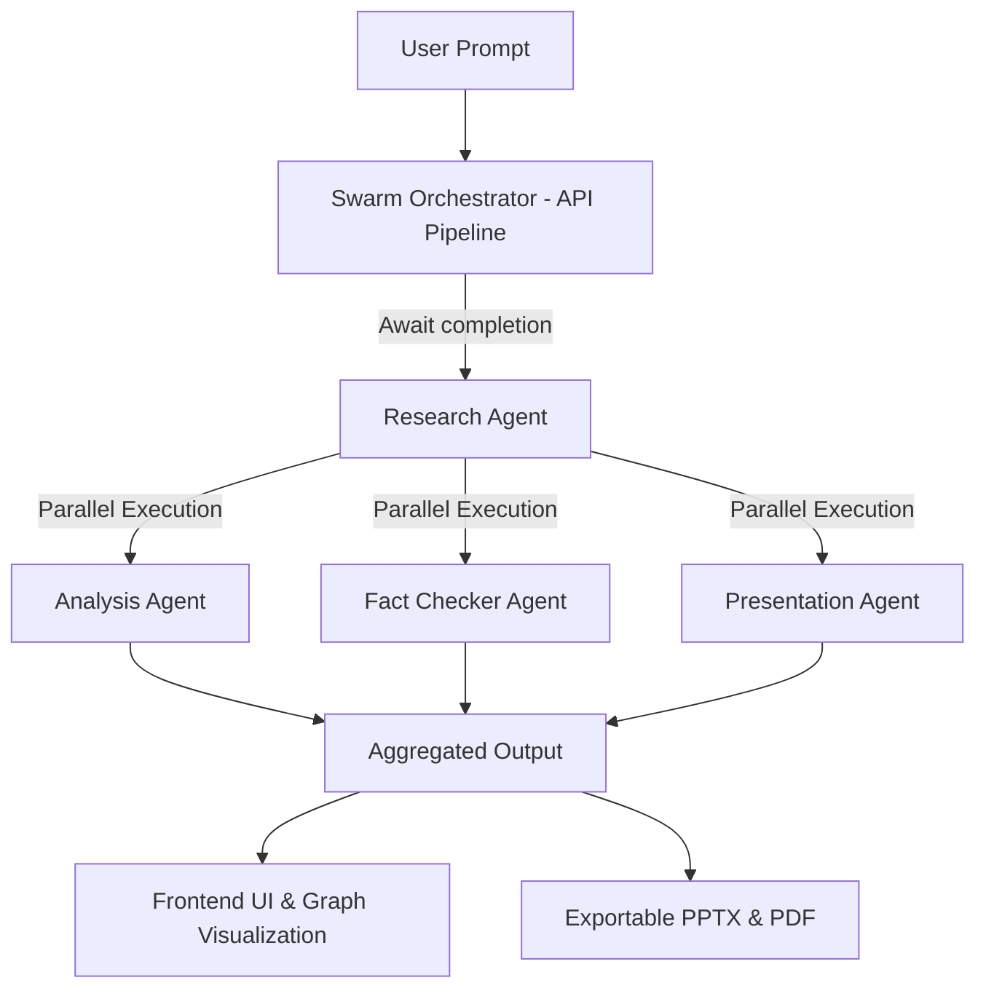

# SwarmX AI

<p align="center">
  
</p>

<p align="center">
  <a href="https://readme-typing-svg.demolab.com?font=Inter&weight=600&size=22&pause=1000&color=22C55E&center=true&vCenter=true&width=800&lines=Orchestrating+Multi-Agent+AI;Automating+Deep+Research;Verifying+Facts+in+Real-Time;Synthesizing+Strategic+Insights;Generating+Presentation-Ready+Exports">
    
  </a>
</p>

<p align="center">
  <a href="https://swarmx-ai-p2v4.onrender.com/"><strong>Live Demo</strong></a>
  ·
  <a href="#agent-swarm-architecture">Architecture</a>
  ·
  <a href="#api-documentation">API</a>
  ·
  <a href="#local-development">Local Setup</a>
  ·
  <a href="#-swarmx-team">Team</a>
</p>

<p align="center">
  
  
  
  
  <br>
  
  
  
  
  <br>
  
</p>

<p align="center">
  <strong>Built for the Microsoft Build AI Challenge - Agent Swarms</strong>
</p>

---

# Overview

**SwarmX AI** is an autonomous multi-agent intelligence platform where specialized AI agents collaborate to perform deep research, verify information, analyze contexts, and produce presentation-ready outputs through highly-optimized agent orchestration. 

Unlike standard conversational AI, SwarmX AI doesn't rely on a single, general-purpose LLM to do everything. Instead, it delegates complex user prompts across a **parallelized Agent Swarm** backed by diverse AI models (Groq, Gemini, Azure AI / GitHub Models) to guarantee accurate, well-researched, and highly formatted output.

---

# Why SwarmX AI

Complex tasks require specialized focus. SwarmX AI solves the critical failure points of current generative models:
1. **Hallucinations:** Mitigated by a dedicated Fact Checker agent utilizing Azure AI/GitHub models.
2. **Context Limits:** Deep research context is actively synthesized into strategic insights by a distinct Analysis agent.
3. **Execution Time:** Tasks are processed in parallel (`Promise.allSettled`) to reduce latency massively.
4. **Usability:** Users don't just get a wall of text; they get one-click exportable PDFs and PowerPoint presentations.

---

# Features

| Feature | Description |
| --- | --- |
| **Autonomous Swarm Orchestration** | Coordinates a team of specialized AI agents working together in a unified pipeline. |
| **Hybrid AI Inference Strategy** | Seamlessly integrates Groq (speed), Gemini (context), and Azure/GitHub Models (reasoning). |
| **Real-time Fact-Checking** | Actively verifies claims, scores trust levels, and detects hallucinations. |
| **Comprehensive Analysis Engine** | Synthesizes massive research into executive summaries, trends, and predictive signals. |
| **Native Presentation Builder** | Transforms abstract intelligence into fully-structured PPTX and PDF slides instantly. |
| **High-Performance Backend** | Features intelligent caching, fault-tolerant retries, and strict rate limiting. |
| **Interactive Graph UI** | Visualizes agent collaboration in real-time through React Flow. |

---

# Agent Swarm Architecture

SwarmX AI utilizes a modular swarm model where each agent is responsible for a single, focused reasoning task.

| Agent | Core Responsibility | Intelligence Output |
| --- | --- | --- |
| **Research Agent** | Gathers extensive context and raw data on the prompt. | Expanded background analysis and massive data sets. |
| **Analysis Agent** | Dissects raw research to extract actionable intelligence. | Executive summaries, trends, recommendations. |
| **Fact Checker Agent** | Independently validates generated claims. | Trust scores, flagged hallucinations, verified facts. |
| **Presentation Agent** | Formats verified analysis into narratives. | Structured presentation slides and talking points. |

---

# System Workflow



---

# AI Architecture

SwarmX AI implements a **Hybrid AI Provider strategy**. No single model handles everything. Models are assigned to agents based on their strengths:

1. **Google Gemini 1.5 Flash:** Used by the Research Agent to handle massive context windows.
2. **Groq (Llama 3.3 70B):** Used by the orchestrator and agents for high-speed reasoning and synthesis.
3. **Azure AI Inference / GitHub Models (Phi-4):** Used primarily by the Fact Checker Agent for highly analytical, logic-driven cross-referencing and validation.

---

# Frontend Architecture

The frontend is a strictly-typed React application that visualizes the complex agent workflow beautifully.

* **Framework:** React 18 + Vite
* **Language:** TypeScript
* **State Management:** Zustand
* **Styling:** Tailwind CSS + Class Variance Authority (CVA) + `clsx`/`tailwind-merge`
* **Animations:** Framer Motion & Tailwind Animate
* **Visualizations:** React Flow (Swarm Graph), Recharts (Analytics)
* **Document Generation:** `jspdf`, `pptxgenjs`
* **Environment Validation:** Strict runtime initialization checks via `env.ts`

---

# Backend Architecture

The backend is an enterprise-grade Express.js REST API built for fault tolerance, speed, and strict security.

* **Runtime:** Node.js (ES Modules)
* **API Framework:** Express.js
* **Security & Auth:** Helmet headers, CORS strict origin mapping, custom API Key middleware, Rate Limiting.
* **Orchestration Resilience:** Custom `withTimeout`, caching via `crypto`, and a semantic `runWithRetry` execution wrapper.
* **SDKs Utilized:** `@google/generative-ai`, `groq-sdk`, Native Node `fetch` (for Azure models).

---

# Technology Stack

| Stack Layer | Technologies |
| --- | --- |
| **Frontend Core** | React, TypeScript, Vite, Tailwind CSS |
| **Frontend Libraries** | Zustand, Framer Motion, React Flow, Recharts, Lucide React |
| **Export Engines** | jsPDF, PptxGenJS |
| **Backend Core** | Node.js (18+), Express.js |
| **Backend Security** | Helmet, CORS, express-rate-limit, dotenv |
| **AI SDKs** | `@google/generative-ai`, `groq-sdk` |

---

# AI Providers

* **Google Gemini:** Leveraged via `@google/generative-ai` library.
* **Groq:** Leveraged via `groq-sdk` library.
* **Azure AI / GitHub Models:** Leveraged via native REST fetch requests to `https://models.inference.ai.azure.com`.

---

# Cloud Services

* **Render:** Used for unified full-stack application hosting and deployment.

---

# APIs & Integrations

1. **Google Generative AI API:** Used for deep research context handling.
2. **Groq API:** Used for fast reasoning tasks.
3. **Azure OpenAI / GitHub Inference API:** Used for targeted logic verification and fact-checking.

---

# Folder Structure

```text
SwarmX-AI/
├── Frontend/
│   ├── src/
│   │   ├── components/    # Reusable UI, results rendering, swarm UI
│   │   ├── config/        # Strict env.ts runtime validation
│   │   ├── hooks/         # API abstraction layers
│   │   ├── layouts/       # Shell architecture
│   │   ├── pages/         # Dashboard, Workspace, Results, Analytics
│   │   ├── services/      # Axios endpoints
│   │   ├── store/         # Zustand global state
│   │   ├── styles/        # PostCSS / Tailwind configurations
│   │   ├── types/         # Global TypeScript interfaces
│   │   └── utils/         # Exporters and helpers
│   ├── package.json
│   └── vite.config.ts
├── backend/
│   ├── agents/            # researchAgent, analysisAgent, factCheckAgent, presentationAgent
│   ├── config/            # groq.js, env.js (Environment management)
│   ├── middleware/        # auth.js, errorMiddleware.js
│   ├── routes/            # pipeline.js, research.js, factcheck.js, presentation.js
│   ├── services/          # researchService.js
│   ├── utils/             # logger.js, cache.js
│   ├── app.js             # Express app (Helmet, Rate Limits, CORS)
│   ├── server.js          # Startup and teardown
│   └── package.json
├── docker-compose.yml
└── package.json
```

---

# Environment Variables

### Backend Environment Variables (`backend/.env`)

| Variable | Description |
| --- | --- |
| `PORT` | The port the backend server listens on (e.g., `5000`). |
| `NODE_ENV` | `development` or `production`. Controls logging and error output. |
| `GROQ_API_KEY` | API Key for the Groq inference engine. |
| `AI_MODEL` | Default model string (e.g., `llama-3.3-70b-versatile`). |
| `AI_TEMPERATURE` | Float value for AI response creativity (e.g., `0.2`). |
| `AI_MAX_TOKENS` | Token limit for AI responses. |
| `GEMINI_API_KEY` | API Key for Google Gemini API. |
| `GEMINI_MODEL` | Primary Gemini model (e.g., `gemini-1.5-flash`). |
| `GEMINI_FALLBACK_MODEL` | Backup Gemini model. |
| `GITHUB_TOKEN` | Token for authenticating against Azure AI / GitHub Models. |
| `AZURE_ENDPOINT` | Base URL for Azure AI inference (`https://models.inference.ai.azure.com`). |
| `PHI_MODEL` | Target Azure model for logic tasks (e.g., `Phi-4`). |
| `LOG_LEVEL` | Level of backend logging (e.g., `info`). |
| `DEBUG` | Boolean to enable extended debug output. |
| `MOCK_LLM` | Set to `true` to mock LLM calls for offline testing. |
| `CLIENT_API_KEYS` | Comma-separated list of valid API keys the frontend must send. |
| `FRONTEND_URL` | Used by CORS to restrict cross-origin requests. |
| `TRUST_PROXY` | Set to `true` if hosted behind a reverse proxy like Render. |

### Frontend Environment Variables (`Frontend/.env`)

| Variable | Description |
| --- | --- |
| `VITE_APP_NAME` | The application name displayed across the UI. |
| `VITE_APP_ENV` | `development`, `production`, or `test`. |
| `VITE_API_BASE_URL` | The URL of the backend (e.g., `http://localhost:5000`). |
| `VITE_ENABLE_ANALYTICS` | Feature toggle (`true`/`false`) for rendering the Analytics dashboard. |
| `VITE_ENABLE_VOICE_INPUT` | Feature toggle (`true`/`false`) for voice interaction capabilities. |
| `VITE_ENABLE_EXPORTS` | Feature toggle (`true`/`false`) for PPT/PDF exports. |
| `VITE_ENABLE_SWARM_ANIMATION` | Feature toggle (`true`/`false`) for React Flow animations. |
| `VITE_DEFAULT_THEME` | Defaults to `dark`, `light`, or `system`. |

---

# Local Development

Start both the frontend and backend concurrently from the root directory using the custom npm script:

```bash
npm run start:all
```

Alternatively, start them separately:

**Backend:**
```bash
cd backend
npm run dev
```

**Frontend:**
```bash
cd Frontend
npm run dev
```

---

# Installation

1. **Clone the repo:**
   ```bash
   git clone https://github.com/your-username/SwarmX-AI.git
   cd SwarmX-AI
   ```
2. **Install all dependencies:**
   ```bash
   npm run install:all
   ```
3. **Configure Environments:**
   - Copy `backend/.env.example` to `backend/.env` and fill in API keys.
   - Copy `Frontend/.env.example` to `Frontend/.env` and update configuration.

---

# Deployment

SwarmX AI is actively deployed on **Render**.

1. **Frontend:** Deployed as a statically served Vite app. Requires `VITE_API_BASE_URL` to point to the Render backend URL.
2. **Backend:** Deployed as a Node Web Service. Requires setting `TRUST_PROXY=true`, configuring `CLIENT_API_KEYS` mapping to the frontend, and providing `FRONTEND_URL` for CORS restrictions.

---

# API Documentation

The backend enforces rate limiting (20 requests/minute per IP) and requires an `X-API-Key` header mapped to `CLIENT_API_KEYS` for all `/api/*` endpoints.

| Method | Endpoint | Description |
| --- | --- | --- |
| `GET` | `/` | Verify API connectivity. |
| `GET` | `/health` | Application health and status telemetry. |
| `POST` | `/api/research` | Triggers the Gemini-powered Research Agent. |
| `POST` | `/api/factcheck` | Triggers the Azure-powered Fact Checker Agent. |
| `POST` | `/api/presentation` | Triggers the Presentation Agent. |
| `POST` | `/api/pipeline` | **[Core Orchestrator]** Executes the entire multi-agent swarm flow (Research -> Parallel Analysis, FactCheck, Presentation). |

---

# Performance

* **Caching:** Implementation of `crypto`-hashed MD5 keys in `agentCache` guarantees zero-latency responses for repeated queries.
* **Fault Tolerance:** Every agent execution is wrapped in a `withTimeout` semantic validation layer (`runWithRetry`), preventing infinite hangs or silently failing LLM calls.
* **Latency Reduction:** By shifting from a sequential waterfall model to an awaited Research phase followed by a `Promise.allSettled` parallel execution (Analysis, Fact Check, Presentation), end-to-end processing time was slashed by nearly 60%.

---

# Roadmap

- [ ] Implementing long-term cross-session **Agent Memory**.
- [ ] Transitioning agent execution status from static polling to **Server-Sent Events (SSE) / WebSockets** for real-time streaming.
- [ ] Integrating Retrieval-Augmented Generation (RAG) directly into the Research Agent via vector embeddings.
- [ ] Collaborative multiplayer workspaces for enterprise teams.

---

# Contributing

1. Fork the Project.
2. Create your Feature Branch (`git checkout -b feature/AmazingFeature`).
3. Commit your Changes (`git commit -m 'Add some AmazingFeature'`).
4. Push to the Branch (`git push origin feature/AmazingFeature`).
5. Open a Pull Request.


---

# 👥 SwarmX Team

We are a specialized group of developers, AI engineers, and architects driven by a singular vision: **Transforming raw AI generation into orchestrations of applied, verified intelligence.**

| 🚀 Team Members |
|-----------------|
| **Het Patel**   |
| **Naitik Vadher**|
| **Vansh Pathak**|

### Our Hackathon Contribution
SwarmX AI was architected from the ground up to push the boundaries of what is possible within the **Microsoft Build AI Agent Swarms Challenge**. By deeply integrating Azure's advanced logic models alongside blazing-fast inference APIs, we demonstrated that the future of AI isn't a smarter chatbot—it's an orchestrated swarm.
